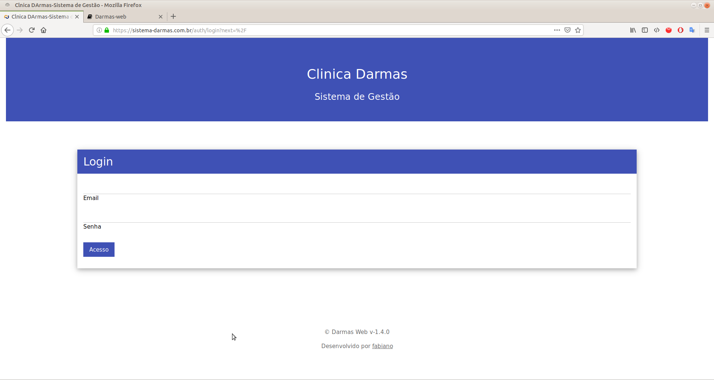

# Sistema de gestão da Clinica Darmas

Sistema hospedado no seguinte domínio [sistema-darmas.com.br](https://sistema-darmas.com.br).

## Login no sistema

Para ter acesso ao sistema é necessário a solicitação de usuário e senha para o administrador do mesmo, feito isso, basta acessar a [url](https://sistema-darmas.com.br) do sistema que a seguinte tela de login será exibida:

## Perfis e permissões

Cada usuário do sistema possui um perfil de acordo com a atividade exercida na clinica, cabe ao admisnitrador definir qual o perfil mais adequado para cada integrante da equipe. Os seguintes perfis estão disponiveis:

* Administrador: Manutenção do sistema.
* Profissional: Nas suas atividades de Psicólogo, Psiquiatra, Nutricionista, Fonoaudiólogo e Neurologista;
* Recepcionista: Responsável por dar manutenção na agenda de pacientes.

## Pacientes

## Profissionais

## Agendas

## Sobre este sistema
